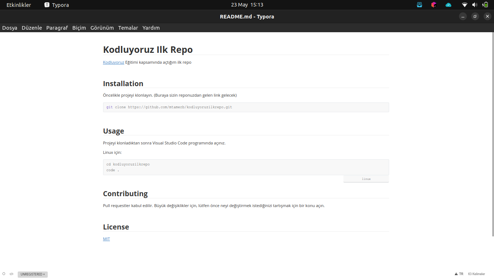

# Kodluyoruz Ilk Repo
[Kodluyoruz](https://www.kodluyoruz.org/) Eğitimi kapsamında açtığım ilk repo



>Örnek Proje Resmi


## Installation

Öncelikle projeyi klonlayın. (Buraya sizin reponuzdan gelen link gelecek)

```bash
git clone https://github.com/mtamerb/kodluyoruzilkrepo.git
```


## Usage

Projeyi klonladıktan sonra Visual Studio Code programında açınız.

Linux için:

```linux
cd kodluyoruzilkrepo
code .
```


## Contributing

Pull requestler kabul edilir. Büyük değişiklikler için, lütfen önce neyi değiştirmek istediğinizi tartışmak için bir konu açın.


## License
[MIT](https://choosealicense.com/licenses/mit/)


